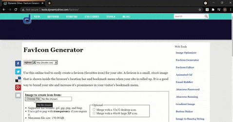

# NewsWorld

*"A simple static website for a news website that contains many articles arranged on the screen using the extremely helpful CSS Grid"*

## Tech Stack

- HTML
- CSS
    - CSS Grid
    - FlexBox
    - Media Queries
    - CSS Variables
    - Favicon

## Installation

Clone the git repository:

```sourceCode console
$ git clone https://github.com/SASHA-PAIS/NewsWorld.git

$ cd NewsWorld
```

## Overview

NewsWorld is a simple static news website that has many news articles arranged using CSS Grid. We also make use of the flexbox framework wherever necessary in order to align items in a 1-dimensional space. Lots of utility classes are created that can be reused throughout the website. The entire project has been made completely responsive with the help of media queries for screen size below 768px.

## Deployment

### Overview of the entire website


### Dynamic drive favicon is used to generate the favicon that is pasted in the root directory and not the img folder.  (ctrl + F5 to clear your cache in windows)



### The website is deployed using netlify, free of cost. For this, you need to have your project pushed to a repository on GitHub.


 
### The form submission feature can be used for the contact form submission on Netlify, which is a great replacement for a PHP script!


## Acknowledgement

- https://cdnjs.com/ to obtain the link tag for fontawesome (icons)
- https://fonts.google.com/for some amazing font options
- https://tools.dynamicdrive.com/favicon/ for the favicon generator
- https://www.netlify.com/ for website deployment
- Tips used from Brad Traversy from Udemy